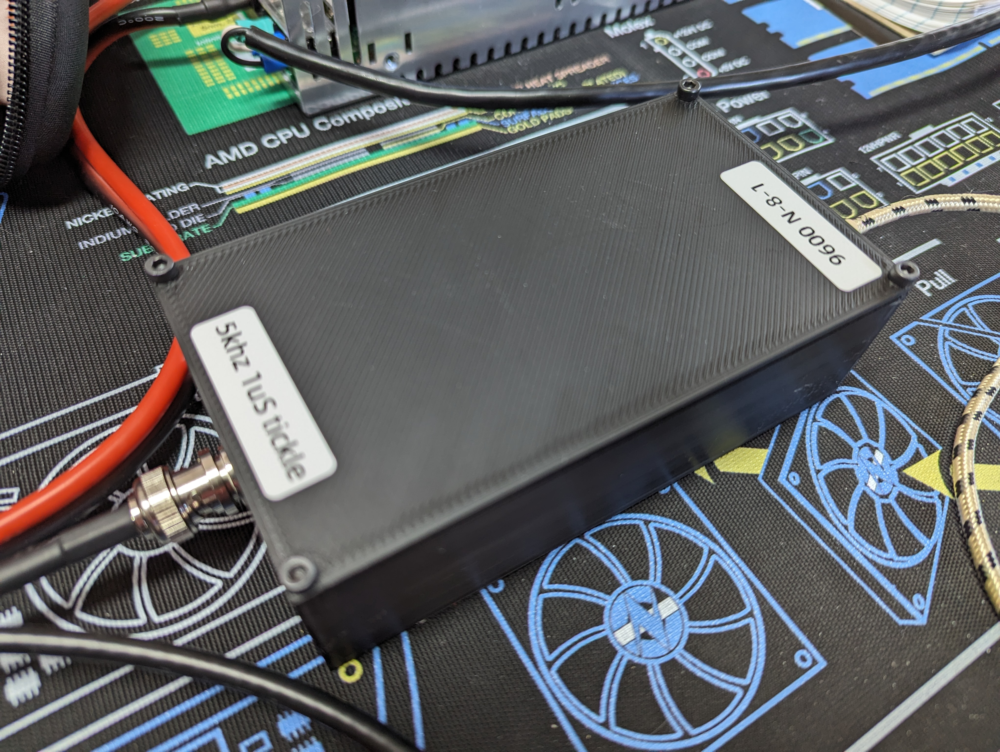
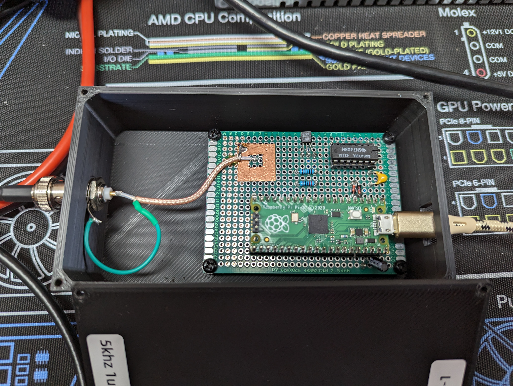

# PewPewPWM
PWM Laser Controller for Synrad 48-1KAM and other compatible lasers.

This project uses a PI Pico, it's support for PWM, and a simple circuit used to shift level and buffer the output.

We use a couple AND gates, a 2N3904 Transistor, a couple resistors and capacitors for filtering, to level shift a PWM output from the PI Pico, generating the 5Khz/1uS Tickle pulses and integrated PWM signal to control the laser power. The Tickle is always maintained at no PWM for Laser output stability and hardware durability.

Currently it only supports a simple Text-based serial interface with no real safety disable. The vision for future is to create a simple Windows WPF application for an additional GUI interface, support on-time duration settings(Pulse-On Modes), and add a normally closed safety kill switch.

As of the end of winter '24 this is my primary hobby project, so check back for more details and videos!

## Schematics
[Circuit Used](Circuit/circuit.png)

Initial BOM:
- 1ea 2N3904
- 1ea 220 Ohm
- 1ea 1K Ohm
- 1ea 10uF 50V Electrolytic
- 1ea 100nF
- 1ea SN7408N, about any two TTL __AND__ or other Gates, including Buffers would work
Note - If you use different gates remember to adapt the circuit when using negated logic.
- 1ea BNC connector
- 1ea PI PICO or equivilant MicroPython(For included software to work) MCU

I also added a couple signal Diodes for simple circuit protection and noise filter. These are optional.
- 2ea 1N4148

## Case STLs
3D Printable Files
Top:
[Case Top](STL/PewPewPWM_Top.stl)
Case:
[Case](STL/PewPewPWM_Case.stl)

## Short video of my laser in operation

